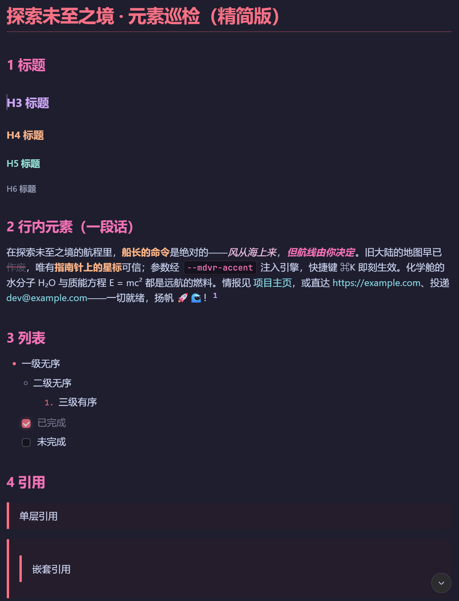
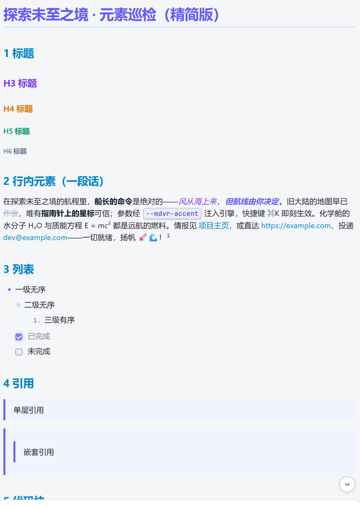
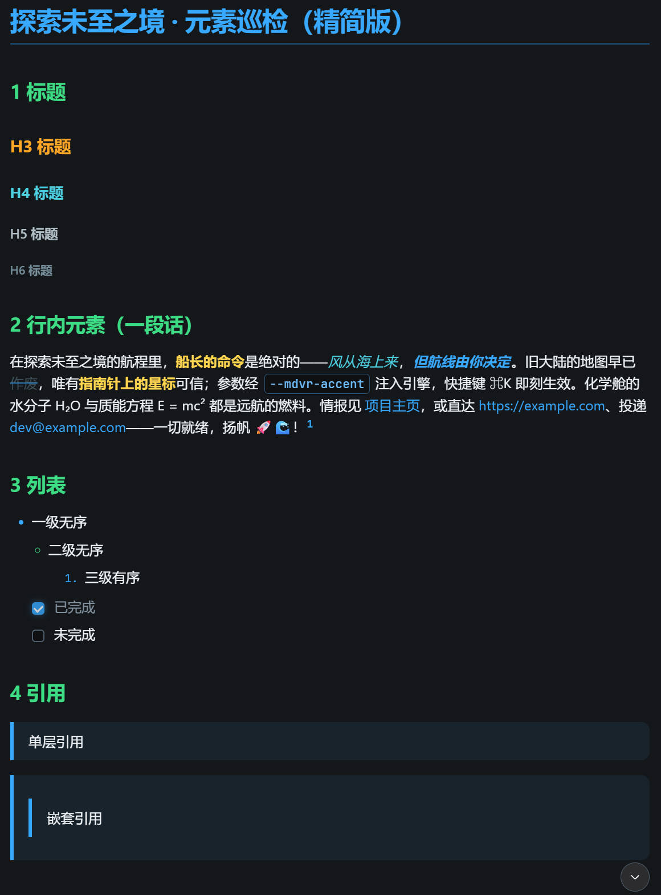
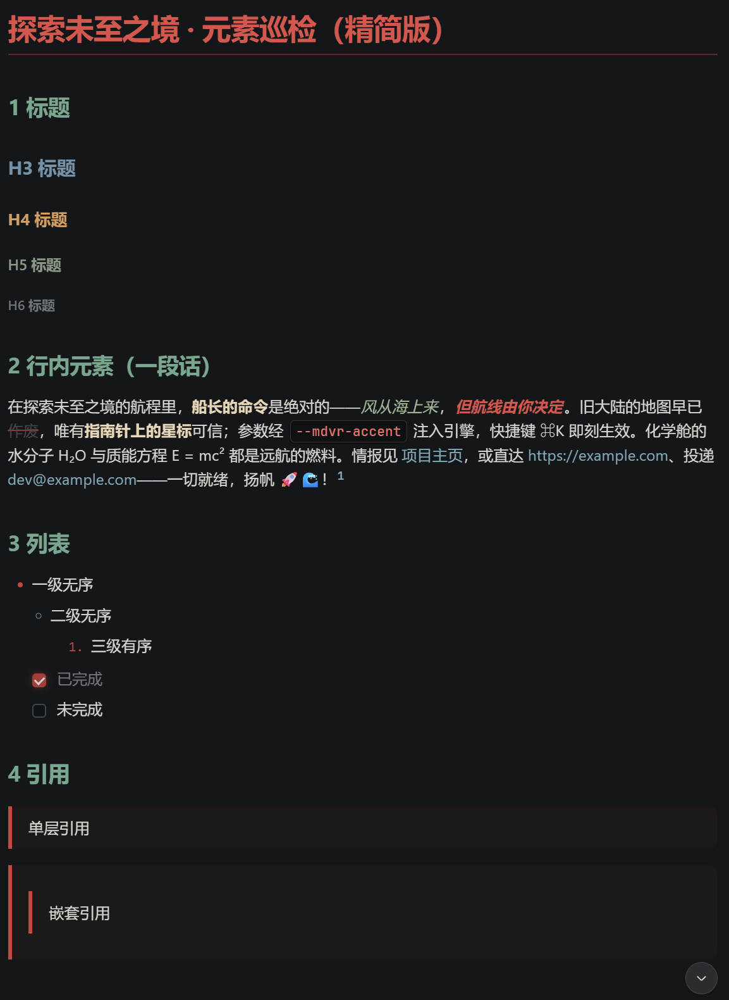

# dsh-markdown-xyy

**Theme the Markdown in your DeepSeek Harness conversations — 4 built-in themes (light/dark), user-defined themes, and a version ledger for the plugin itself.**

[](LICENSE)
[](manifest/versions.json)
[](README.en.md)
[](README.md)

A Cordis plugin for [DeepSeek Harness](https://github.com/deepseek-ai). It reskins the Markdown rendering in conversations with pure CSS — headings, code blocks, tables, quotes, links, highlights — without touching the product's baseline theme. Every theme ships a light and a dark variant that follow the system appearance.

## 📖 Why this project exists

The reason is simple: **the native conversation styling is not built for reading long walls of text.**

When a lot of conversation text piles up, everything looks "flat" — headings, quotes, key points and code all lean on default typography, and the faster you scan, the easier it is to miss what matters. Since I deal with large amounts of conversation text every day, **coloring the key information and layering the hierarchy** became essential: being able to spot the essentials at a glance makes even the longest conversations readable.

That is exactly what this project does: a "reading-assist" theme for Markdown in conversations — emphasized highlights, clear typography, light/dark variants, and never touching the product's default theme.

> This project was built end-to-end with AI: core development by my partner **deepseek-v4-flash**, with the four themes' palettes refined with help from my international friend **Gemini**.

## Theme previews

| Strawberry Mocha `strawberry-mocha` | Cyber Titanium `cyber-titanium` |
| :---: | :---: |
|  |  |
| Velvet strawberry × Catppuccin Mocha nights, the reference implementation | Space Black × anodized titanium purple × electric cyan × cool silver |

| High-Vis Clarity `high-vis-clarity` | Pine Smoke Ink `pine-smoke-ink` |
| :---: | :---: |
|  |  |
| High-contrast cool white × pure sky blue × golden accents, built for low-gamut displays | Ink-stick incense × cinnabar × misty indigo × rice-paper cool white |

> Previews live in [screenshots/](screenshots/); overwrite the same filenames to swap images.

## Features

- **✔️ 4 built-in themes**, each with light / dark variants; ☀️ / 🌙 / 🖥️ appearance modes follow the system
- **✔️ Drop-in user themes**: put a CSS file into `~/.dsh/web-themes/` and it becomes a theme — no packaging, no plugin upgrades
- **✔️ Live theme editor**: create / edit user themes in Settings with syntax highlighting, one-click formatting, and double-side CSS validation
- **✔️ Element-level progressive styling**: `:where()` zero-specificity overrides only touch bare Markdown elements; explicit product styles always win
- **✔️ Immutable version ledger**: every iteration is one immutable Package; current version and full history are shown in the run card, rollback anytime
- **✔️ Two install channels**: session-scoped dynamic loading (dev iterations) or permanent install (`dsh plugin add`, survives restarts)

## Quick start

Prerequisite: a running DeepSeek Harness (`dsh web`). No runtime dependencies, no npm install needed.

**Option 1 — permanent install (recommended, survives restarts)**

Install directly from the npm registry (published: [dsh-markdown-xyy](https://www.npmjs.com/package/dsh-markdown-xyy)):

```bash
dsh plugin --profile web add dsh-markdown-xyy
```

Or follow the latest GitHub main (handy while a mirror hasn't synced the new npm package yet):

```bash
dsh plugin --profile web add github:mengnanxyyyy/dsh-markdown-xyy
```

Then open **Settings → Theme Settings**: switch between "System native" and the 4 built-in themes, or create / edit user themes.

**Option 2 — dynamic, session-scoped loading (development mode)**

```bash
node scripts/build-client.js                         # sync source → artifact + asset checks
node scripts/minify.js plugin/host.js /tmp/host.min.js
node scripts/minify.js plugin/client.js /tmp/client.min.js
```

In a Harness session, `cordis_define` (pass host + client halves together, pluginId prefix `mdvr`) → `cordis_run`, then verify in the browser. Dynamic plugins are in-memory: they are lost on process restart and must be redefined.

> Both channels share the same source; only the transport differs (dynamic uses the harness RPC channel, installed uses `webServer` HTTP routes).

## Custom themes

A theme is a single CSS file in three sections: ① light `body {…}` ② dark `body[data-ds-dark-theme] {…}` ③ element overrides `:where()`. See [docs/themes.md](docs/themes.md) and the commented template `plugin/assets/template.css`; the variable contract (L0 platform tokens / L1 identity colors / L2 constants / L3 knobs) is documented in [docs/variables.md](docs/variables.md).

## Project layout

```
dsh-markdown-xyy/
├── README.md / README.en.md     # Chinese / English README
├── AGENTS.md                    # project conventions for agent contributors
├── LICENSE                      # MIT
├── package.json                 # installed-package manifest (main=lib/index.mjs, exports ./client)
├── cordis.patch.yml             # dsh bundle plugin row (mounted via dsh plugin add)
├── screenshots/                 # theme preview images (README gallery)
├── docs/                        # architecture / themes / variables / capabilities / development
├── manifest/
│   └── versions.json            # persisted version ledger
├── lib/
│   └── index.mjs                # installed Host half (generated)
├── client/
│   └── client.js                # installed Client half (__ModuleLoader__, generated)
├── plugin/
│   ├── host.js                  # Host half source mirror (ledger + theme-asset RPC)
│   ├── client.js                # dynamic-mode Client half artifact (do not hand-edit)
│   ├── src/client.core.js       # Client half source (single editable source)
│   └── assets/                  # panel.css / template.css / themes/ (4 built-in themes)
└── scripts/
    ├── build-client.js          # dynamic-mode artifact build
    ├── build-installed.js       # installed-mode halves build
    ├── check-release.js         # release gate
    └── minify.js                # safe minification for define transport
```

## Docs

| Doc | What it covers |
| --- | --- |
| [docs/architecture.md](docs/architecture.md) | Architecture: halves, version model, theme pipeline, dual channels |
| [docs/themes.md](docs/themes.md) | Theme system: capability boundary, file format, user themes |
| [docs/variables.md](docs/variables.md) | Variable contract: L0 tokens / L1 colors / L2 constants / L3 knobs |
| [docs/capabilities.md](docs/capabilities.md) | Capability list and roadmap |
| [docs/development.md](docs/development.md) | Development & release flow (one iteration = one Package) |

## Development

The iteration loop **bump MANIFEST → build → define → run → verify → tag** is documented in [docs/development.md](docs/development.md). Before releasing, run the release gate:

```bash
node scripts/check-release.js
```

## License

[MIT](LICENSE) © 2026 dsh-markdown-xyy contributors